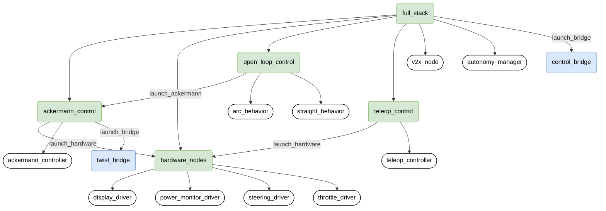

# PiRacer ROS2
ROS2 package for [Waveshare PiRacer](https://www.waveshare.com/piracer-ai-kit.htm).

## I2C Devices

---
* `0x40` PCA9685 (steering servo control)
  * steering servo connected to channel `0`
  * compatible with Adafruit PCA9685 Python library
* `0x41` Unknown
* `0x3c` SSD1306 OLED display
* `0x60` PCA9685 (motor control)
  * motor control connected to channel `3`
  * compatible with Adafruit PCA9685 Python library
  * compatible with Adafruit motor hat
    * use `motor3`
* `0x70` Unknown

## Launching

### Launch hierarchy
Below is the hierarchy of the launch files. `hardware_nodes` is necessary for any of the other launch files to do
anything, but for practical purposes it should never need to be launched by itself.

### Launch file options
1. `full_stack.launch.py`: Launches all possible control modes at once, as well as the autonomy_manager.
2. `open_loop_control.py`: Launches the open loop controllers and the ackermann_controller node.
3. `ackermann_control.launch.py`: For use with the twist mode of the mqtt_bridge package.
4. `teleop_control.launch.py`: For use with a gamepad / controller.

### Command-line arguments
1. `agent_name`: Sets the namespace for all the nodes and topics. Necessary to set when launching multiple cars on the
same ROS domain at once, otherwise there will be collisions and the cars will not function. 
    * Default value: `car1`
    * When using this argument, it is necessary to change the first line of `config/car_config.yaml` to match, otherwise 
      the parameter values **will not be loaded**.
1. `launch_bridge`: Controls the launching of bridges from the `mqtt_bridge` package.
    * Default value: `True`
    * This should be left as true unless the bridges are being launched manually elsewhere.
  
### Launch examples
The following examples will only work after the package has already been successfully built using `colcon build 
--packages-select piracer` and the install directory sourced, via `source install/setup.bash`.
1. `ros2 launch piracer full_stack.launch.py agent_name:=car1`
    * Launches every control mode and the autonomy manager, in the namespace `/car1/`.
1. `ros2 launch piracer teleop_control.launch.py agent_name:=car2`
    * Launches the controller-driven mode, in the namespace `/car2/`.
    * It is necessary to change line 1 of `config/car_config.yaml` for the parameter values to be loaded.
    
```yaml
car2:
  autonomy_manager:
    ros__parameters:
 #...
```

## Usage

### Control Modes
The following are the currently implemented control modes. Switching between these is handled within the `autonomy_manager`
node, using ROS2 services. The commands from the `command` bridge to enable these modes are strings and are 
case-insensitive.

1. `direct`: `twist` messages containing steering_angle and throttle commands are sent from the 
   `twist` bridge and parsed by the `ackermann_controller` node.
   * **Default**: this is the state every car is in on launch
   * Enabled via sending the string `direct` through the command bridge
2. `auto`: Does nothing as currently implemented.
   * Enabled via sending the string `auto` through the command bridge
3. `experiment`: Starts a ROS timer, which then controls the vehicle using a state machine and the open-loop
controllers `straight_behavior` and `arc_behavior`.
   * Enabled via sending the string `experiment` through the command bridge
   
### Bridges
The following are bridges from the `mqtt_bridge` package that must be launched and in the appropriate namespace (have 
the same `agent_name`) for cars to function  properly for `direct` mode and mode switching. They are automatically
launched as needed unless `launch_bridge` is set to `False`.

1. `twist`: sends `twist` messages to the `ackermann_controller` node while the car is in `direct` mode
   * As the `autonomy_mode` node relies on a service that lives in the `twist` bridge to enable / disable 
     `direct` mode, it hangs until the `twist` bridge is launched, outputting to the logger that it is
     waiting for the service to be available.
1. `command`: allows for mode switching, as previously described in the [Control Modes](#control-modes) section.


### Spring 2023 Demo

1. Pushing code to the car, using VSCode to develop, run this command from the 
`piracer-internal` folder on the development machine: `rsync -rlptzv --progress --exclude=.git . "ubuntu@piracer-01:~/dev_ws/src/
 piracer-internal"`

1. Running the code on the car: `ros2 launch piracer full_stack.launch.py config_file:="/home/ubuntu/dev_ws/src/
 piracer_configs-internal/car1_config.yaml"`