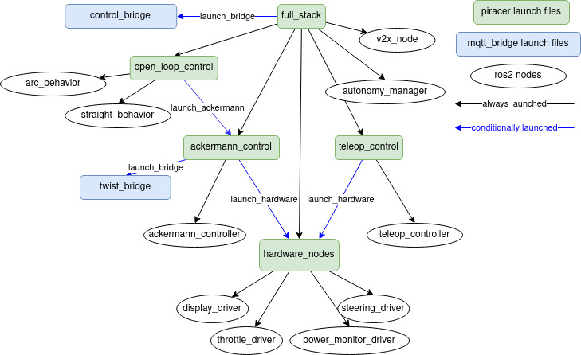

# PiRacer ROS2
ROS2 package for [Waveshare PiRacer](https://www.waveshare.com/piracer-ai-kit.htm).

## I2C Devices

---
* `0x40` PCA9685 (steering servo control)
  * steering servo connected to channel `0`
  * compatible with Adafruit PCA9685 Python library
* `0x41` Unknown
* `0x3c` SSD1306 OLED display
* `0x60` PCA9685 (motor control)
  * motor control connected to channel `3`
  * compatible with Adafruit PCA9685 Python library
  * compatible with Adafruit motor hat
    * use `motor3`
* `0x70` Unknown

## Launching / Using the package

### Launch hierarchy
Below is the hierarchy of the launch files. `hardware_nodes` is necessary for any of the other launch files to do
anything, but for practical purposes it should never need to be launched by itself.

### Launch file options
1. `full_stack.launch.py`: Launches all possible control modes at once, as well as the autonomy_manager.
1. `ackermann_control.launch.py`: For use with the ackermann_drive mode of the mqtt_bridge package.
1. `teleop_control.launch.py`: For use with a gamepad / controller.

### Command-line arguments
1. `agent_name`: Sets the namespace for all the nodes and topics. Necessary to set when launching multiple cars on the
same ROS domain at once, otherwise there will be collisions and the cars will not function. 
   * Default value: `car1`
  
### Launch examples
The following examples will only work after the package has already been successfully built using `colcon build 
--packages-select piracer` and the install directory sourced, via `source install/setup.bash`.
1. `ros2 launch piracer full_stack.launch.py agent_name:=car1`
    * Launches every control mode and the autonomy manager, in the namespace `/car1/`.
1. `ros2 launch piracer teleop_control.launch.py agent_name:=car2`
    * Launches the controller-driven mode, in the namespace `/car2/`.